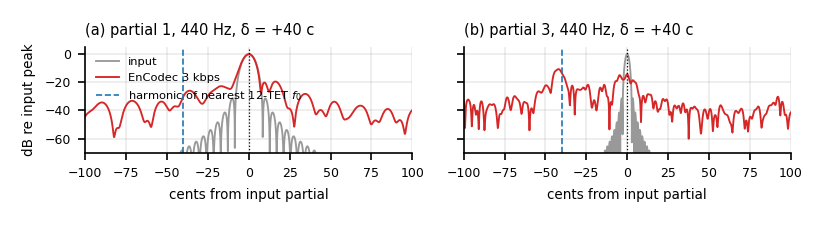

# Where a neural audio codec pulls pitch toward equal temperament

Code, raw result files and provenance for the ICASSP 2027 submission
*Where a Neural Audio Codec Pulls Pitch Toward Equal Temperament*
(Shivam Chauhan, MBZUAI). The manuscript is in [`paper/`](paper/).

Neural vocoders are known to pull output tuning toward 12-tone equal
temperament. This repository treats a neural audio codec as a measurement
instrument to locate where that happens: pairs of harmonic tones a fixed
interval apart are coded, a blind estimator reads the decoded interval back,
and the decoded spectrum is read partial by partial. At low bitrate the
decoder transmits the lower partials and invents the rest above a band edge;
the fundamental stays put, the invented partials land most of the way onto
the harmonic ladder of the nearest 12-TET pitch, and a full-band estimator
reports a displacement no partial underwent. Fine-tuning only EnCodec's
decoder on a corpus retuned by 33 cents moves the grid by 32.7 cents.

<p align="center">
  <br>
  <em>Fig. 1 of the paper. A 440 Hz complex detuned +40 cents through EnCodec at 3 kbps:
  H1 below the edge stays put, H3 at the edge splits into two lines, H4 above it is
  regenerated onto the harmonic of the nearest 12-TET pitch.</em>
</p>

## Contents

```
paper/            manuscript PDF, every reported value with its provenance
                  (values.csv), the three tables as CSV, and PAPER_TO_RESULTS.md,
                  which maps each paper element to the script and raw file behind it
results/          raw per-trial CSV, one .meta.json sidecar per run recording the
                  full argument set and package versions (results/README.md)
RESULTS.md        every derived statistic, generated from results/ by
                  analysis/make_results.py; never hand-edited
experiments/      measurement entry points; each writes raw per-trial CSV
analysis/         every derived number and figure
figures/          the paper's figures and the scripts that draw them
data/             corpus and checkpoint acquisition
infra/            Slurm and detached-session tooling for the long sweeps
docs/             DATA.md (sources and licences), PIPELINE.md, CLUSTER.md
PREDICTIONS.md    the pre-registration document with its amendment log
```

`run_*.py` computes no statistics. It writes raw estimates and a sidecar.
Every derived number comes from `analysis/`, so the analysis can be rerun
and audited without repeating the codec passes.

## Quickstart

```bash
python -m venv .venv && . .venv/bin/activate
pip install -r requirements.txt
python data/fetch_checkpoints.py      # about 2 GB, the codec checkpoints
make gate
```

`make gate` runs the three checks that must pass before any measurement
means anything: the estimator's noise floor on uncoded stimuli, the whole
pipeline with no codec in the loop (must report null), and the pilot sweep on
EnCodec. It takes a few minutes on CPU. The pitch experiments are CPU-bound
on F0 estimation; only the fine-tuning arms need a GPU.

## Reproducing the paper

[`REPRODUCE.md`](REPRODUCE.md) gives the command behind each experiment.
[`paper/PAPER_TO_RESULTS.md`](paper/PAPER_TO_RESULTS.md) maps each figure,
table and section of the paper to its script and raw files, and marks the
few result families produced on a second machine that are not yet uploaded
here. The headline measurements:

| Paper | Command | Raw file |
|---|---|---|
| Registration slope and bias, EnCodec 3 kbps (Sec. 3.1) | `make detune` | `results/detune_encodec3.csv` |
| Every codec row of Table 1 | `experiments/run_sweep.py --codec <name> --references $REFS` | `results/detune_*.csv` |
| Per-partial displacements, Fig. 1 and Table 2 | `experiments/spectral_sweep.py`, `analysis/analyze_spectral.py` | `results/spectral_sweep.csv` |
| Quantiser bypass and rate sweep (Sec. 3.2) | `make rate` | `results/mech_bypass.csv`, `results/rate_encodec_*.csv` |
| Decoder fine-tuning arms, five seeds (Sec. 3.3) | `experiments/finetune_encodec.py`, `analysis/summary_causal.py` | `results/ftm_*_s{0..4}.csv` |
| Real recordings, frame-wise bias (Sec. 3.4) | `experiments/corpus_pull.py`, `analysis/analyze_corpus_pull.py` | `results/corpus_pull_*.csv` |
| Regenerate all derived statistics | `make results` | `RESULTS.md` |
| Regenerate the figures | `make figures` | `figures/` |

`$REFS` is the eleven reference pitches defined at the top of the `Makefile`.

## What is measured

For a stimulus `x(theta)` in which one property takes value `theta`, and an
estimator `E` recovering it:

```
T(theta) = med_trials E[ C(x(theta)) ]        transfer function
r(theta) = T(theta) - theta                   residual
b(theta) = -sign(delta(theta)) * r(theta)      grid bias, delta = signed distance to 12-TET
```

A condition *registers* when the slope of the residual's phase against the
reference detuning lies inside 1 +/- 0.15 (an equivalence test), and *pulls*
when it also meets the pre-specified pull rule (on-grid phase within 45
degrees of 180, off-grid bias interval clearing zero). The *band edge* is the
lowest regenerated partial and the *ladder fraction* is how far the partials
at or above it move toward the grid harmonic. The paper's Section 2 defines
each in full.

## Controls built into the pipeline

| Control | What it rules out |
|---|---|
| `identity` codec | any effect from the stimuli, estimator or analysis |
| Detuned reference | an effect locked to the interval rather than absolute pitch |
| Per-sample-rate noise floor | estimator error read as codec error |
| Octave gate at 200 cents | estimator failures; the only exclusion in the primary analysis |
| Estimator cross-check | robustness variant only, never the primary number |
| Amplitude-stability and retention guards | a confident slope fitted through noise phases (two codecs are refused, and reported as such) |
| Quantiser bypass | the effect living in the tokens rather than the decoder |
| Opus, MP3, HE-AAC with SBR | band replication without a learned prior |
| Grid-preserving resamplings of the fine-tuning corpus | resampling artefacts in the causal experiment |

## Pre-registration

`PREDICTIONS.md` is the registered prediction document with its amendment
log. The paper reports which registered predictions held and which failed;
the analyses added after the data were seen are marked exploratory there and
in the paper.

## Environment

Results were produced under `torch 2.8.0` and `transformers 5.16.1`; every
`.meta.json` sidecar records the versions of its run. `requirements.txt`
pins them and explains what is deliberately not installed.

## Citation

```bibtex
@inproceedings{chauhan2027codecpitch,
  author    = {Shivam Chauhan},
  title     = {Where a Neural Audio Codec Pulls Pitch Toward Equal Temperament},
  booktitle = {Proc. IEEE ICASSP},
  year      = {2027},
  note      = {Submitted}
}
```

## Licence

MIT. See [LICENSE](LICENSE). Corpora and checkpoints keep their own licences
(see `docs/DATA.md`); no corpus audio is redistributed here.
