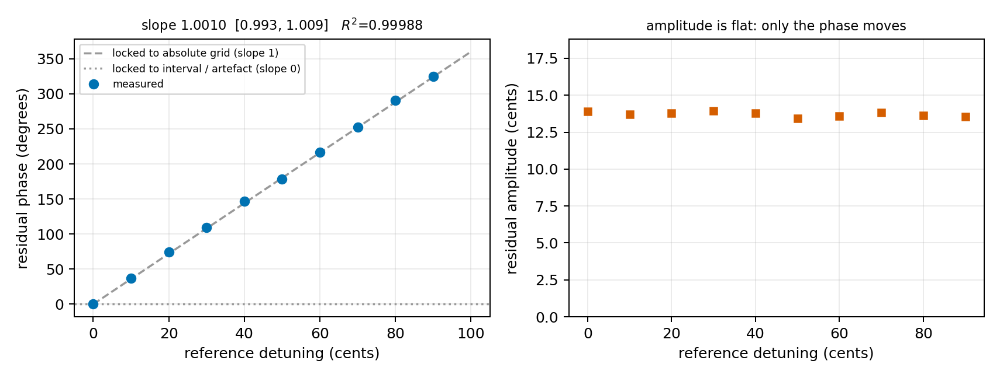
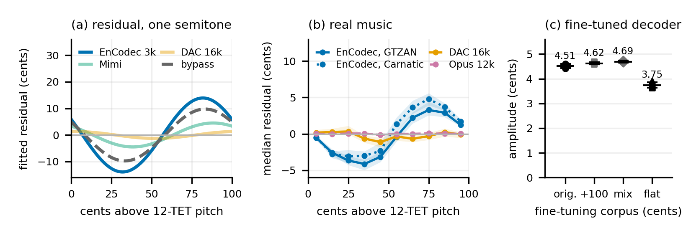
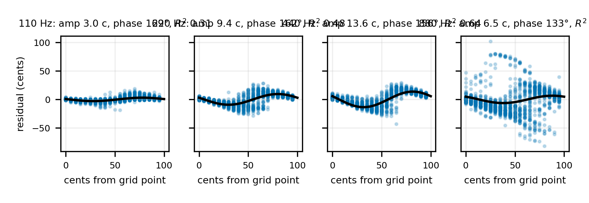
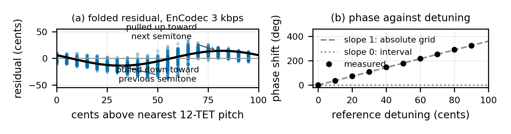
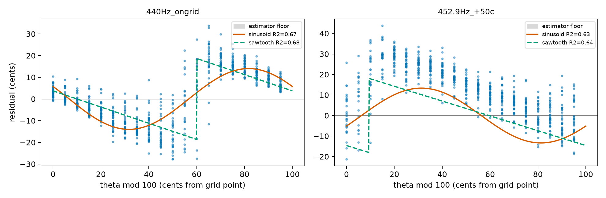
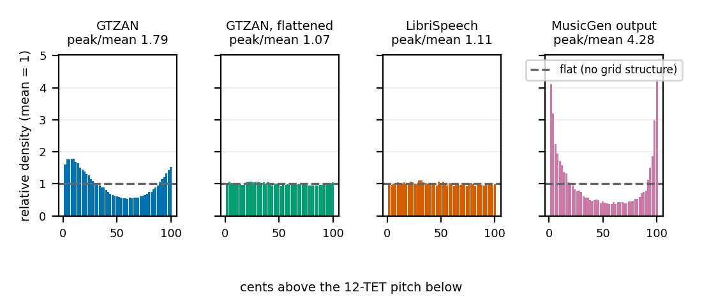
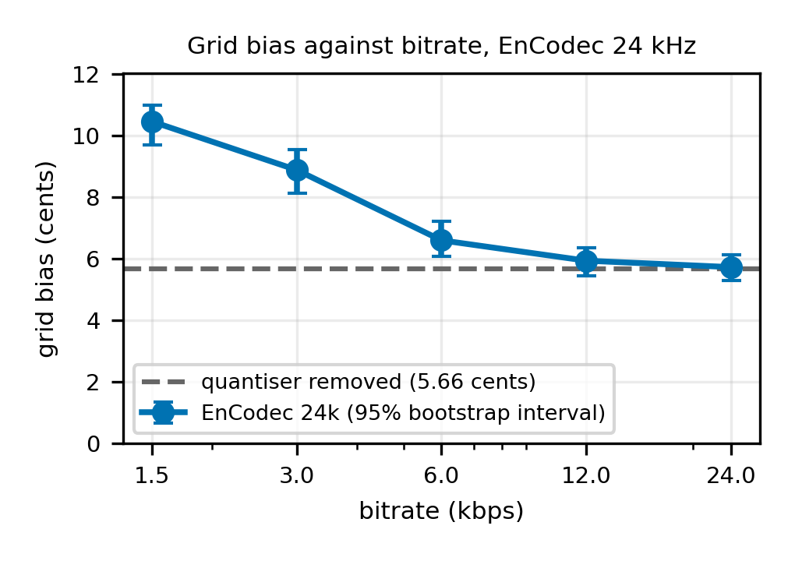
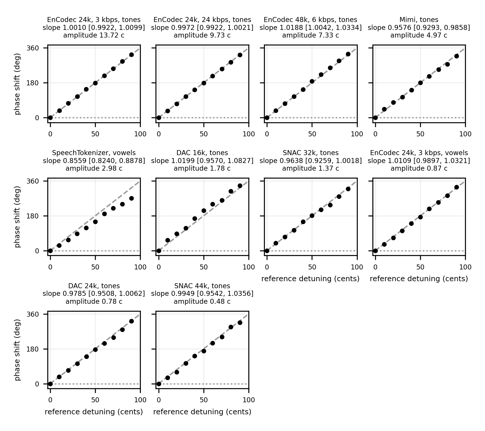
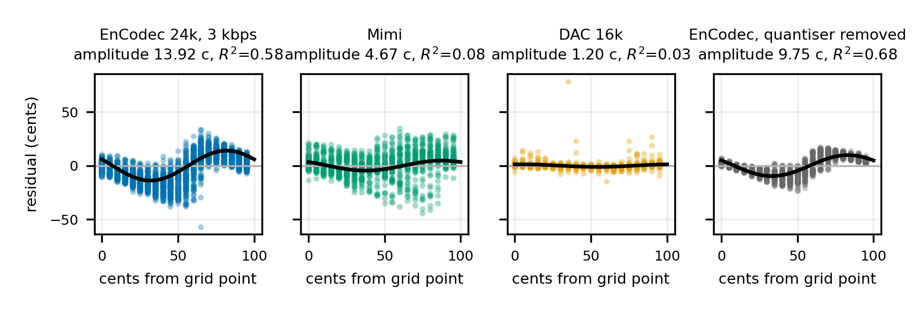
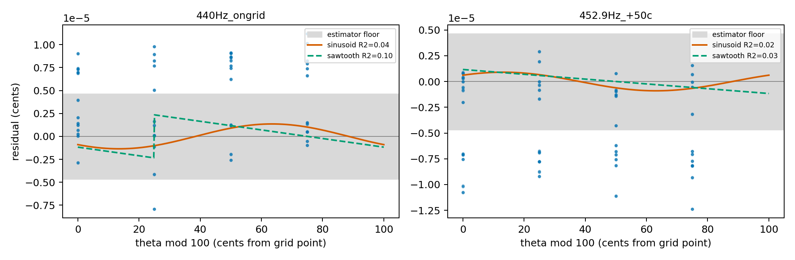

# Results

<!-- GENERATED FILE. Do not edit by hand.
     Regenerate with:  python analysis/make_results.py
     Every number below is computed from a CSV in results/. Nothing here is a
     prediction, a placeholder, or a value typed by a human.
     Exclusion scheme: octave gate only, as in the paper. -->

Every figure and table here is derived from a file in `results/`. Experiments
that have not run are listed as not yet measured rather than shown with
placeholder values.

## Pitch transfer function
| run | codec | rate | reference | n | floor (c) | on-grid (c) | off-grid (c) | ratio | grid bias (c) | 95% CI | sine R2 | saw R2 | better |
|---|---|---|---|---|---|---|---|---|---|---|---|---|---|
| `causal_12tet` | trained_12tet | 12tet-Q4 | 440Hz_ongrid | 151 | 4.9e-06 | 0.091 | 0.268 | 2.95 | -0.006 | [-0.03, 0.00] | 0.03 | 0.03 | n/a, below floor |
| `causal_12tet` | trained_12tet | 12tet-Q4 | 452.9Hz_+50c | 107 | 5.2e-06 | 0.330 | 0.223 | 0.67 | -0.061 | [-0.14, 0.00] | 0.04 | 0.05 | n/a, below floor |
| `causal_53tet` | trained_53tet | 53tet-Q4 | 440Hz_ongrid | 190 | 4.9e-06 | 0.062 | 0.066 | 1.07 | 6.4e-04 | [0.00, 0.01] | 0.02 | 0.03 | sawtooth |
| `causal_53tet` | trained_53tet | 53tet-Q4 | 452.9Hz_+50c | 131 | 5.2e-06 | 0.111 | 0.141 | 1.26 | -0.011 | [-0.07, 0.00] | 0.01 | 0.03 | n/a, below floor |
| `causal_uniform` | trained_uniform | uniform-Q4 | 440Hz_ongrid | 151 | 4.9e-06 | 0.067 | 0.094 | 1.39 | -0.004 | [-0.03, 0.01] | 0.03 | 0.06 | n/a, below floor |
| `causal_uniform` | trained_uniform | uniform-Q4 | 452.9Hz_+50c | 90 | 5.2e-06 | 0.144 | 0.109 | 0.75 | 0.007 | [-7.0e-03, 0.05] | 0.03 | 0.03 | sawtooth |
| `codec_dac16` | dac | Q6 | 440Hz_ongrid | 540 | 1.6e-05 | 0.945 | 0.839 | 0.89 | 0.000 | [-0.03, 5.2e-04] | 0.03 | 0.03 | n/a, below floor |
| `codec_dac16` | dac | Q6 | 452.9Hz_+50c | 201 | 3.0e-05 | 0.908 | 1.397 | 1.54 | -0.017 | [-0.31, 0.12] | 0.09 | 0.14 | n/a, below floor |
| `codec_dac24` | dac | Q8 | 440Hz_ongrid | 1205 | 4.9e-06 | 0.429 | 0.879 | 2.05 | 0.030 | [0.00, 0.10] | 0.10 | 0.10 | sinusoid |
| `codec_dac24` | dac | Q8 | 452.9Hz_+50c | 1205 | 5.2e-06 | 1.085 | 1.598 | 1.47 | -0.128 | [-0.34, 0.00] | 0.11 | 0.10 | n/a, below floor |
| `codec_dac44` | dac | Q4 | 440Hz_ongrid | 1137 | 2.9e-06 | 0.226 | 0.411 | 1.82 | 0.000 | [0.00, 0.03] | 3.4e-03 | 0.02 | n/a, below floor |
| `codec_dac44` | dac | Q4 | 452.9Hz_+50c | 1143 | 5.0e-06 | 0.593 | 0.366 | 0.62 | 0.000 | [-0.02, 0.00] | 5.3e-03 | 0.01 | n/a, below floor |
| `codec_encodec48` | encodec | 6.0kbps | 440Hz_ongrid | 1205 | 4.9e-06 | 1.209 | 7.740 | 6.40 | 3.965 | [3.55, 4.30] | 0.46 | 0.44 | sinusoid |
| `codec_encodec48` | encodec | 6.0kbps | 452.9Hz_+50c | 1154 | 5.2e-06 | 13.465 | 13.609 | 1.01 | -2.841 | [-4.08, -1.27] | 0.24 | 0.24 | n/a, below floor |
| `codec_mimi` | mimi | Q8 | 440Hz_ongrid | 1199 | 4.9e-06 | 5.464 | 7.158 | 1.31 | 2.147 | [1.41, 3.07] | 0.08 | 0.05 | sinusoid |
| `codec_mimi` | mimi | Q8 | 452.9Hz_+50c | 1199 | 5.2e-06 | 9.551 | 7.738 | 0.81 | -2.213 | [-3.26, -1.51] | 0.08 | 0.05 | n/a, below floor |
| `codec_speechtok` | speechtokenizer | Q8 | 440Hz_ongrid | 777 | 1.6e-05 | 55.217 | 47.398 | 0.86 | 0.000 | [-7.34, 0.00] | 2.9e-03 | 4.3e-03 | n/a, below floor |
| `codec_speechtok` | speechtokenizer | Q8 | 452.9Hz_+50c | 632 | 3.0e-05 | 51.929 | 52.810 | 1.02 | 5.757 | [0.00, 11.51] | 1.8e-03 | 4.0e-03 | sawtooth |
| `ctrl_identity` | identity | uncoded | 440Hz_ongrid | 1205 | 4.9e-06 | 6.5e-06 | 6.0e-06 | n/a, below floor | 7.5e-08 | [0.00, 4.9e-07] | 8.6e-03 | 0.02 | n/a, below floor |
| `ctrl_identity` | identity | uncoded | 452.9Hz_+50c | 1205 | 5.2e-06 | 5.1e-06 | 5.4e-06 | n/a, below floor | 0.000 | [-2.4e-07, 0.00] | 4.9e-03 | 0.02 | n/a, below floor |
| `ctrl_sinusoid` | encodec | 3.0kbps | 440Hz_ongrid | 1205 | 2.9e-05 | 0.094 | 0.105 | 1.11 | 2.6e-04 | [0.00, 0.01] | 4.6e-03 | 6.7e-03 | sawtooth |
| `ctrl_sinusoid` | encodec | 3.0kbps | 452.9Hz_+50c | 1205 | 4.9e-05 | 0.200 | 0.195 | 0.98 | 0.000 | [-0.02, 0.00] | 2.6e-03 | 5.3e-03 | n/a, below floor |
| `detune_dac16` | dac | Q6 | 440Hz_ongrid | 425 | 1.6e-05 | 0.960 | 0.891 | 0.93 | 0.000 | [-0.04, 0.00] | 0.07 | 0.06 | n/a, below floor |
| `detune_dac16` | dac | Q6 | 442.5Hz_+09.8c | 508 | 8.6e-06 | 1.165 | 1.680 | 1.44 | 0.155 | [0.00, 0.44] | 0.12 | 0.10 | sinusoid |
| `detune_dac16` | dac | Q6 | 445.1Hz_+20.0c | 200 | 2.1e-05 | 0.849 | 0.494 | 0.58 | 0.326 | [0.21, 0.45] | 0.10 | 0.14 | sawtooth |
| `detune_dac16` | dac | Q6 | 447.7Hz_+30.0c | 70 | 1.2e-05 | 0.551 | 1.136 | 2.06 | 0.455 | [0.10, 0.84] | 0.17 | 0.18 | sawtooth |
| `detune_dac16` | dac | Q6 | 450.3Hz_+40.1c | 94 | 1.2e-05 | 0.901 | 1.568 | 1.74 | 0.163 | [-0.20, 0.69] | 0.07 | 0.14 | sawtooth |
| `detune_dac16` | dac | Q6 | 452.9Hz_+50.0c | 143 | 2.7e-05 | 0.980 | 1.220 | 1.25 | -0.082 | [-0.35, 0.04] | 0.09 | 0.13 | n/a, below floor |
| `detune_dac16` | dac | Q6 | 455.5Hz_+59.9c | 466 | 9.2e-06 | 0.953 | 1.345 | 1.41 | -0.330 | [-0.52, -0.21] | 0.13 | 0.13 | n/a, below floor |
| `detune_dac16` | dac | Q6 | 458.2Hz_+70.2c | 484 | 1.6e-05 | 1.477 | 1.534 | 1.04 | -0.375 | [-0.69, -0.10] | 0.10 | 0.11 | n/a, below floor |
| `detune_dac16` | dac | Q6 | 460.8Hz_+80.0c | 405 | 1.1e-05 | 1.820 | 1.994 | 1.10 | -0.694 | [-1.15, -0.30] | 0.12 | 0.14 | n/a, below floor |
| `detune_dac16` | dac | Q6 | 463.5Hz_+90.1c | 567 | 9.1e-06 | 2.005 | 2.797 | 1.40 | -1.117 | [-1.73, 0.00] | 0.11 | 0.12 | n/a, below floor |
| `detune_dac24` | dac | Q8 | 440Hz_ongrid | 964 | 4.9e-06 | 0.436 | 0.863 | 1.98 | 0.035 | [0.00, 0.11] | 0.10 | 0.10 | sinusoid |
| `detune_dac24` | dac | Q8 | 442.5Hz_+09.8c | 964 | 4.5e-06 | 0.439 | 0.902 | 2.06 | 0.133 | [0.06, 0.19] | 0.09 | 0.08 | sinusoid |
| `detune_dac24` | dac | Q8 | 445.1Hz_+20.0c | 964 | 7.0e-06 | 0.936 | 1.077 | 1.15 | 0.256 | [0.06, 0.37] | 0.10 | 0.10 | sawtooth |
| `detune_dac24` | dac | Q8 | 447.7Hz_+30.0c | 964 | 1.2e-05 | 1.161 | 0.872 | 0.75 | 0.164 | [0.03, 0.32] | 0.09 | 0.09 | sinusoid |
| `detune_dac24` | dac | Q8 | 450.3Hz_+40.1c | 964 | 5.4e-06 | 0.898 | 0.746 | 0.83 | 0.119 | [0.03, 0.20] | 0.08 | 0.08 | sinusoid |
| `detune_dac24` | dac | Q8 | 452.9Hz_+50.0c | 964 | 4.8e-06 | 1.029 | 1.601 | 1.56 | -0.055 | [-0.43, 0.00] | 0.10 | 0.10 | n/a, below floor |
| `detune_dac24` | dac | Q8 | 455.5Hz_+59.9c | 964 | 4.5e-06 | 1.351 | 1.566 | 1.16 | -0.648 | [-0.84, -0.46] | 0.08 | 0.10 | n/a, below floor |
| `detune_dac24` | dac | Q8 | 458.2Hz_+70.2c | 964 | 5.0e-06 | 0.909 | 0.650 | 0.71 | -0.243 | [-0.34, -0.18] | 0.10 | 0.10 | n/a, below floor |
| `detune_dac24` | dac | Q8 | 460.8Hz_+80.0c | 964 | 4.5e-06 | 0.881 | 0.891 | 1.01 | -0.206 | [-0.30, -0.09] | 0.09 | 0.10 | n/a, below floor |
| `detune_dac24` | dac | Q8 | 463.5Hz_+90.1c | 964 | 4.7e-06 | 0.632 | 1.054 | 1.67 | 0.000 | [-0.01, 0.01] | 0.10 | 0.11 | n/a, below floor |
| `detune_dac44` | dac | Q4 | 440Hz_ongrid | 910 | 2.9e-06 | 0.215 | 0.405 | 1.88 | 0.000 | [0.00, 0.03] | 4.8e-03 | 0.02 | n/a, below floor |
| `detune_dac44` | dac | Q4 | 442.5Hz_+09.8c | 911 | 3.6e-06 | 0.284 | 0.353 | 1.24 | 0.000 | [-5.9e-04, 8.6e-03] | 4.4e-03 | 0.02 | n/a, below floor |
| `detune_dac44` | dac | Q4 | 445.1Hz_+20.0c | 909 | 6.9e-06 | 0.369 | 0.397 | 1.07 | 0.000 | [0.00, 0.02] | 8.2e-03 | 0.02 | n/a, below floor |
| `detune_dac44` | dac | Q4 | 447.7Hz_+30.0c | 911 | 4.0e-06 | 0.556 | 0.376 | 0.68 | 0.000 | [0.00, 0.05] | 2.3e-03 | 0.01 | n/a, below floor |
| `detune_dac44` | dac | Q4 | 450.3Hz_+40.1c | 911 | 4.7e-06 | 0.626 | 0.328 | 0.52 | 0.000 | [0.00, 0.01] | 1.1e-03 | 6.6e-03 | n/a, below floor |
| `detune_dac44` | dac | Q4 | 452.9Hz_+50.0c | 917 | 6.3e-06 | 0.517 | 0.360 | 0.70 | 0.000 | [-0.05, 0.00] | 2.7e-03 | 0.01 | n/a, below floor |
| `detune_dac44` | dac | Q4 | 455.5Hz_+59.9c | 913 | 4.2e-06 | 0.572 | 0.431 | 0.75 | 0.000 | [-0.03, 0.00] | 8.0e-03 | 0.02 | n/a, below floor |
| `detune_dac44` | dac | Q4 | 458.2Hz_+70.2c | 908 | 3.9e-06 | 0.484 | 0.442 | 0.91 | 0.000 | [-0.01, 0.02] | 0.01 | 0.01 | n/a, below floor |
| `detune_dac44` | dac | Q4 | 460.8Hz_+80.0c | 916 | 5.0e-06 | 0.450 | 0.576 | 1.28 | -0.020 | [-0.07, 0.00] | 0.01 | 0.01 | n/a, below floor |
| `detune_dac44` | dac | Q4 | 463.5Hz_+90.1c | 905 | 5.1e-06 | 0.316 | 0.623 | 1.97 | 0.007 | [0.00, 0.05] | 0.01 | 0.02 | sawtooth |
| `detune_encodec24kbps` | encodec | 24.0kbps | 440Hz_ongrid | 964 | 4.9e-06 | 2.607 | 8.860 | 3.40 | 5.727 | [5.18, 6.19] | 0.69 | 0.63 | sinusoid |
| `detune_encodec24kbps` | encodec | 24.0kbps | 442.5Hz_+09.8c | 964 | 4.5e-06 | 2.208 | 9.752 | 4.42 | 6.144 | [5.75, 6.63] | 0.68 | 0.62 | sinusoid |
| `detune_encodec24kbps` | encodec | 24.0kbps | 445.1Hz_+20.0c | 964 | 7.0e-06 | 2.457 | 11.433 | 4.65 | 4.712 | [4.19, 5.27] | 0.69 | 0.59 | sinusoid |
| `detune_encodec24kbps` | encodec | 24.0kbps | 447.7Hz_+30.0c | 964 | 1.2e-05 | 2.776 | 13.823 | 4.98 | 2.613 | [2.08, 3.31] | 0.68 | 0.61 | sinusoid |
| `detune_encodec24kbps` | encodec | 24.0kbps | 450.3Hz_+40.1c | 964 | 5.4e-06 | 4.509 | 11.743 | 2.60 | 0.000 | [-0.64, 0.00] | 0.62 | 0.56 | n/a, below floor |
| `detune_encodec24kbps` | encodec | 24.0kbps | 452.9Hz_+50.0c | 964 | 4.8e-06 | 4.845 | 7.997 | 1.65 | -4.254 | [-5.57, -3.16] | 0.68 | 0.60 | n/a, below floor |
| `detune_encodec24kbps` | encodec | 24.0kbps | 455.5Hz_+59.9c | 964 | 4.5e-06 | 7.737 | 4.555 | 0.59 | -5.876 | [-6.42, -5.39] | 0.68 | 0.60 | n/a, below floor |
| `detune_encodec24kbps` | encodec | 24.0kbps | 458.2Hz_+70.2c | 964 | 5.0e-06 | 6.751 | 7.754 | 1.15 | -3.842 | [-4.90, -3.28] | 0.67 | 0.62 | n/a, below floor |
| `detune_encodec24kbps` | encodec | 24.0kbps | 460.8Hz_+80.0c | 964 | 4.5e-06 | 2.623 | 13.243 | 5.05 | 0.980 | [0.00, 2.04] | 0.67 | 0.61 | sinusoid |
| `detune_encodec24kbps` | encodec | 24.0kbps | 463.5Hz_+90.1c | 964 | 4.7e-06 | 2.571 | 13.372 | 5.20 | 4.437 | [3.99, 5.05] | 0.69 | 0.63 | sinusoid |
| `detune_encodec3` | encodec | 3.0kbps | 440Hz_ongrid | 1205 | 4.9e-06 | 4.199 | 13.727 | 3.27 | 8.884 | [8.12, 9.55] | 0.65 | 0.59 | sinusoid |
| `detune_encodec3` | encodec | 3.0kbps | 442.5Hz_+10c | 1205 | 8.2e-06 | 3.812 | 16.191 | 4.25 | 9.150 | [8.68, 9.94] | 0.63 | 0.55 | sinusoid |
| `detune_encodec3` | encodec | 3.0kbps | 445.1Hz_+20c | 1205 | 8.3e-06 | 3.830 | 19.011 | 4.96 | 6.834 | [6.25, 7.52] | 0.66 | 0.60 | sinusoid |
| `detune_encodec3` | encodec | 3.0kbps | 447.7Hz_+30c | 1205 | 4.5e-06 | 4.242 | 24.152 | 5.69 | 4.760 | [3.40, 5.69] | 0.65 | 0.60 | sinusoid |
| `detune_encodec3` | encodec | 3.0kbps | 450.3Hz_+40c | 1202 | 8.9e-06 | 5.774 | 23.945 | 4.15 | 0.000 | [-0.05, 0.21] | 0.53 | 0.49 | n/a, below floor |
| `detune_encodec3` | encodec | 3.0kbps | 452.9Hz_+50c | 1205 | 5.1e-06 | 8.918 | 16.009 | 1.80 | -4.923 | [-6.99, -3.52] | 0.57 | 0.51 | n/a, below floor |
| `detune_encodec3` | encodec | 3.0kbps | 455.5Hz_+40c | 1205 | 4.7e-06 | 12.603 | 6.858 | 0.54 | -8.329 | [-8.91, -7.69] | 0.54 | 0.46 | n/a, below floor |
| `detune_encodec3` | encodec | 3.0kbps | 458.2Hz_+30c | 1205 | 8.2e-06 | 3.948 | 19.529 | 4.95 | 0.000 | [-1.31, 0.00] | 0.60 | 0.54 | n/a, below floor |
| `detune_encodec3` | encodec | 3.0kbps | 460.8Hz_+20c | 1205 | 4.5e-06 | 3.472 | 22.192 | 6.39 | 2.837 | [1.94, 3.86] | 0.64 | 0.59 | sinusoid |
| `detune_encodec3` | encodec | 3.0kbps | 463.5Hz_+10c | 1205 | 7.2e-06 | 3.862 | 20.546 | 5.32 | 5.813 | [4.82, 6.83] | 0.63 | 0.57 | sinusoid |
| `detune_encodec3` | encodec | 3.0kbps | 466.2Hz_ongrid | 1205 | 6.4e-06 | 4.607 | 15.570 | 3.38 | 8.365 | [7.78, 9.02] | 0.63 | 0.58 | sinusoid |
| `detune_encodec3_220` | encodec | 3.0kbps | 220Hz_ongrid | 1205 | 8.3e-06 | 2.261 | 9.791 | 4.33 | 5.850 | [5.39, 6.28] | 0.48 | 0.36 | sinusoid |
| `detune_encodec3_220` | encodec | 3.0kbps | 221.3Hz_+10.0c | 1205 | 8.7e-06 | 2.217 | 11.171 | 5.04 | 5.799 | [5.33, 6.20] | 0.48 | 0.36 | sinusoid |
| `detune_encodec3_220` | encodec | 3.0kbps | 222.6Hz_+20.0c | 1205 | 8.7e-06 | 2.401 | 13.167 | 5.48 | 4.636 | [4.17, 5.19] | 0.47 | 0.37 | sinusoid |
| `detune_encodec3_220` | encodec | 3.0kbps | 223.8Hz_+30.0c | 1205 | 8.4e-06 | 2.945 | 14.986 | 5.09 | 2.346 | [1.68, 3.39] | 0.50 | 0.38 | sinusoid |
| `detune_encodec3_220` | encodec | 3.0kbps | 225.1Hz_+40.0c | 1161 | 1.0e-05 | 6.169 | 12.398 | 2.01 | -1.077 | [-2.19, 0.00] | 0.35 | 0.27 | n/a, below floor |
| `detune_encodec3_220` | encodec | 3.0kbps | 226.4Hz_+50.0c | 1203 | 1.3e-05 | 9.144 | 6.087 | 0.67 | -5.967 | [-6.56, -5.24] | 0.41 | 0.31 | n/a, below floor |
| `detune_encodec3_220` | encodec | 3.0kbps | 227.8Hz_+60.0c | 1205 | 1.7e-05 | 8.681 | 10.125 | 1.17 | -5.161 | [-6.33, -4.13] | 0.40 | 0.30 | n/a, below floor |
| `detune_encodec3_220` | encodec | 3.0kbps | 229.1Hz_+70.0c | 1205 | 2.0e-05 | 4.300 | 16.720 | 3.89 | 0.000 | [0.00, 0.18] | 0.48 | 0.37 | n/a, below floor |
| `detune_encodec3_220` | encodec | 3.0kbps | 230.4Hz_+80.0c | 1205 | 7.2e-06 | 3.426 | 16.893 | 4.93 | 2.539 | [1.47, 3.43] | 0.49 | 0.36 | sinusoid |
| `detune_encodec3_220` | encodec | 3.0kbps | 231.7Hz_+90.0c | 1204 | 1.1e-05 | 2.887 | 13.498 | 4.68 | 4.759 | [4.08, 5.37] | 0.49 | 0.37 | sinusoid |
| `detune_encodec3_220` | encodec | 3.0kbps | 233.1Hz_ongrid | 1205 | 2.5e-05 | 2.363 | 10.531 | 4.46 | 6.014 | [5.57, 6.51] | 0.49 | 0.36 | sinusoid |
| `detune_encodec3_880` | encodec | 3.0kbps | 880Hz_ongrid | 1145 | 3.4e-06 | 4.815 | 20.647 | 4.29 | 7.936 | [7.14, 8.84] | 0.04 | 0.03 | sinusoid |
| `detune_encodec3_880` | encodec | 3.0kbps | 885.1Hz_+10.0c | 1136 | 3.8e-06 | 4.296 | 20.084 | 4.68 | 8.375 | [7.41, 9.22] | 0.04 | 0.03 | sinusoid |
| `detune_encodec3_880` | encodec | 3.0kbps | 890.2Hz_+20.0c | 1127 | 4.2e-06 | 5.317 | 21.855 | 4.11 | 7.720 | [6.87, 8.44] | 0.04 | 0.03 | sinusoid |
| `detune_encodec3_880` | encodec | 3.0kbps | 895.4Hz_+30.0c | 1115 | 3.6e-06 | 6.026 | 24.341 | 4.04 | 6.088 | [4.81, 7.13] | 0.03 | 0.02 | sinusoid |
| `detune_encodec3_880` | encodec | 3.0kbps | 900.6Hz_+40.0c | 1103 | 3.9e-06 | 9.074 | 21.349 | 2.35 | 2.310 | [0.85, 4.03] | 0.03 | 0.03 | sinusoid |
| `detune_encodec3_880` | encodec | 3.0kbps | 905.8Hz_+50.0c | 1096 | 4.2e-06 | 13.148 | 15.489 | 1.18 | -0.954 | [-2.95, 0.00] | 0.03 | 0.02 | n/a, below floor |
| `detune_encodec3_880` | encodec | 3.0kbps | 911Hz_+60.0c | 1085 | 2.7e-06 | 23.888 | 11.796 | 0.49 | -7.351 | [-8.90, -5.94] | 0.03 | 0.02 | n/a, below floor |
| `detune_encodec3_880` | encodec | 3.0kbps | 916.3Hz_+70.0c | 1076 | 4.2e-06 | 12.167 | 22.650 | 1.86 | 0.000 | [-0.10, 0.45] | 0.03 | 0.02 | n/a, below floor |
| `detune_encodec3_880` | encodec | 3.0kbps | 921.6Hz_+80.0c | 1064 | 4.1e-06 | 6.989 | 26.608 | 3.81 | 4.839 | [2.80, 6.61] | 0.03 | 0.02 | sinusoid |
| `detune_encodec3_880` | encodec | 3.0kbps | 927Hz_+90.0c | 1054 | 3.3e-06 | 5.896 | 24.306 | 4.12 | 6.903 | [5.72, 7.96] | 0.02 | 0.01 | sinusoid |
| `detune_encodec3_880` | encodec | 3.0kbps | 932.3Hz_+100.0c | 1041 | 3.5e-06 | 5.029 | 22.027 | 4.38 | 7.791 | [6.91, 8.62] | 0.03 | 0.02 | sinusoid |
| `detune_encodec48` | encodec | 6.0kbps | 440Hz_ongrid | 964 | 4.9e-06 | 1.221 | 7.611 | 6.23 | 3.958 | [3.52, 4.32] | 0.46 | 0.45 | sinusoid |
| `detune_encodec48` | encodec | 6.0kbps | 442.5Hz_+09.8c | 964 | 4.5e-06 | 1.105 | 7.555 | 6.84 | 3.521 | [3.16, 3.90] | 0.46 | 0.45 | sinusoid |
| `detune_encodec48` | encodec | 6.0kbps | 445.1Hz_+20.0c | 964 | 7.0e-06 | 1.739 | 7.355 | 4.23 | 2.180 | [1.88, 2.52] | 0.48 | 0.48 | sawtooth |
| `detune_encodec48` | encodec | 6.0kbps | 447.7Hz_+30.0c | 962 | 1.2e-05 | 2.628 | 9.316 | 3.55 | 1.495 | [0.96, 2.16] | 0.45 | 0.45 | sinusoid |
| `detune_encodec48` | encodec | 6.0kbps | 450.3Hz_+40.1c | 748 | 5.4e-06 | 4.101 | 7.803 | 1.90 | -1.554 | [-3.01, -0.51] | 0.34 | 0.33 | n/a, below floor |
| `detune_encodec48` | encodec | 6.0kbps | 452.9Hz_+50.0c | 920 | 4.8e-06 | 13.265 | 13.036 | 0.98 | -3.213 | [-5.35, -1.57] | 0.24 | 0.23 | n/a, below floor |
| `detune_encodec48` | encodec | 6.0kbps | 455.5Hz_+59.9c | 964 | 4.5e-06 | 9.613 | 18.381 | 1.91 | 0.000 | [-2.6e-03, 1.97] | 0.33 | 0.34 | n/a, below floor |
| `detune_encodec48` | encodec | 6.0kbps | 458.2Hz_+70.2c | 964 | 5.0e-06 | 6.600 | 17.744 | 2.69 | 1.610 | [0.00, 5.12] | 0.37 | 0.39 | sawtooth |
| `detune_encodec48` | encodec | 6.0kbps | 460.8Hz_+80.0c | 964 | 4.5e-06 | 4.496 | 13.668 | 3.04 | 3.819 | [2.55, 5.14] | 0.41 | 0.43 | sawtooth |
| `detune_encodec48` | encodec | 6.0kbps | 463.5Hz_+90.1c | 964 | 4.7e-06 | 3.344 | 10.973 | 3.28 | 4.886 | [4.30, 5.37] | 0.44 | 0.47 | sawtooth |
| `detune_mimi` | mimi | Q8 | 440Hz_ongrid | 961 | 4.9e-06 | 5.845 | 7.116 | 1.22 | 2.161 | [1.37, 3.19] | 0.07 | 0.05 | sinusoid |
| `detune_mimi` | mimi | Q8 | 442.5Hz_+09.8c | 951 | 4.5e-06 | 7.336 | 12.645 | 1.72 | 2.137 | [0.46, 3.52] | 0.06 | 0.04 | sinusoid |
| `detune_mimi` | mimi | Q8 | 445.1Hz_+20.0c | 961 | 7.0e-06 | 10.877 | 18.643 | 1.71 | 2.990 | [0.33, 5.20] | 0.07 | 0.05 | sinusoid |
| `detune_mimi` | mimi | Q8 | 447.7Hz_+30.0c | 960 | 1.2e-05 | 8.979 | 15.487 | 1.72 | 0.682 | [0.00, 2.44] | 0.03 | 0.03 | sinusoid |
| `detune_mimi` | mimi | Q8 | 450.3Hz_+40.1c | 961 | 5.4e-06 | 10.142 | 12.353 | 1.22 | 0.000 | [-0.54, 0.00] | 0.06 | 0.05 | n/a, below floor |
| `detune_mimi` | mimi | Q8 | 452.9Hz_+50.0c | 962 | 4.8e-06 | 9.465 | 7.973 | 0.84 | -2.323 | [-3.12, -1.34] | 0.08 | 0.05 | n/a, below floor |
| `detune_mimi` | mimi | Q8 | 455.5Hz_+59.9c | 962 | 4.5e-06 | 12.147 | 9.285 | 0.76 | -3.056 | [-4.42, -1.76] | 0.07 | 0.05 | n/a, below floor |
| `detune_mimi` | mimi | Q8 | 458.2Hz_+70.2c | 960 | 5.0e-06 | 10.708 | 12.196 | 1.14 | -1.633 | [-2.78, -0.45] | 0.07 | 0.07 | n/a, below floor |
| `detune_mimi` | mimi | Q8 | 460.8Hz_+80.0c | 961 | 4.5e-06 | 7.963 | 11.630 | 1.46 | 0.000 | [-0.74, 0.00] | 0.07 | 0.06 | n/a, below floor |
| `detune_mimi` | mimi | Q8 | 463.5Hz_+90.1c | 961 | 4.7e-06 | 5.639 | 10.233 | 1.81 | 0.897 | [0.00, 1.95] | 0.09 | 0.06 | sinusoid |
| `detune_mp316` | mp3 | 16kbps | 440Hz_ongrid | 1205 | 4.9e-06 | 0.010 | 0.011 | 1.17 | 0.000 | [0.00, 6.6e-04] | 0.03 | 0.03 | n/a, below floor |
| `detune_mp316` | mp3 | 16kbps | 442.5Hz_+10.0c | 1205 | 8.2e-06 | 0.012 | 0.012 | 1.00 | 0.000 | [0.00, 7.0e-04] | 0.02 | 0.03 | n/a, below floor |
| `detune_mp316` | mp3 | 16kbps | 445.1Hz_+20.0c | 1205 | 8.3e-06 | 0.011 | 0.011 | 0.98 | 1.8e-04 | [0.00, 1.7e-03] | 0.02 | 0.03 | sawtooth |
| `detune_mp316` | mp3 | 16kbps | 447.7Hz_+30.0c | 1205 | 4.5e-06 | 0.011 | 0.010 | 0.90 | 0.000 | [0.00, 7.4e-04] | 0.02 | 0.02 | n/a, below floor |
| `detune_mp316` | mp3 | 16kbps | 450.3Hz_+40.0c | 1205 | 8.9e-06 | 0.013 | 0.010 | 0.74 | 0.000 | [-7.7e-04, 0.00] | 0.02 | 0.03 | n/a, below floor |
| `detune_mp316` | mp3 | 16kbps | 452.9Hz_+50.0c | 1205 | 5.1e-06 | 0.010 | 0.009 | 1.00 | 0.000 | [0.00, 4.3e-04] | 0.02 | 0.03 | n/a, below floor |
| `detune_mp316` | mp3 | 16kbps | 455.5Hz_+60.0c | 1205 | 4.7e-06 | 0.010 | 0.008 | 0.77 | -6.5e-04 | [-1.4e-03, 0.00] | 0.02 | 0.03 | n/a, below floor |
| `detune_mp316` | mp3 | 16kbps | 458.2Hz_+70.0c | 1205 | 8.1e-06 | 0.007 | 0.007 | 0.98 | 0.000 | [-5.0e-04, 0.00] | 0.02 | 0.02 | n/a, below floor |
| `detune_mp316` | mp3 | 16kbps | 460.8Hz_+80.0c | 1205 | 4.5e-06 | 0.008 | 0.008 | 0.96 | 0.000 | [-1.1e-04, 0.00] | 0.02 | 0.02 | n/a, below floor |
| `detune_mp316` | mp3 | 16kbps | 463.5Hz_+90.0c | 1205 | 7.2e-06 | 0.009 | 0.009 | 1.03 | 0.000 | [-5.2e-04, 0.00] | 0.02 | 0.03 | n/a, below floor |
| `detune_mp316` | mp3 | 16kbps | 466.2Hz_ongrid | 1205 | 6.4e-06 | 0.009 | 0.009 | 1.06 | 0.000 | [0.00, 4.4e-04] | 0.02 | 0.03 | n/a, below floor |
| `detune_mp332` | mp3 | 32kbps | 440Hz_ongrid | 1205 | 4.9e-06 | 0.001 | 0.001 | 0.91 | 0.000 | [-6.8e-05, 0.00] | 1.7e-04 | 3.4e-03 | n/a, below floor |
| `detune_mp332` | mp3 | 32kbps | 442.5Hz_+10.0c | 1205 | 8.2e-06 | 0.001 | 0.002 | 1.05 | 0.000 | [0.00, 9.4e-05] | 2.9e-03 | 3.3e-03 | n/a, below floor |
| `detune_mp332` | mp3 | 32kbps | 445.1Hz_+20.0c | 1205 | 8.3e-06 | 0.001 | 0.002 | 1.14 | 0.000 | [-4.5e-08, 2.7e-05] | 2.6e-04 | 1.9e-03 | n/a, below floor |
| `detune_mp332` | mp3 | 32kbps | 447.7Hz_+30.0c | 1205 | 4.5e-06 | 0.001 | 0.001 | 1.07 | 0.000 | [-2.6e-05, 0.00] | 6.6e-05 | 2.7e-03 | n/a, below floor |
| `detune_mp332` | mp3 | 32kbps | 450.3Hz_+40.0c | 1205 | 8.9e-06 | 0.002 | 0.001 | 0.86 | 0.000 | [0.00, 1.9e-04] | 5.8e-03 | 8.0e-03 | n/a, below floor |
| `detune_mp332` | mp3 | 32kbps | 452.9Hz_+50.0c | 1205 | 5.1e-06 | 0.002 | 0.001 | 0.93 | 0.000 | [-3.4e-05, 0.00] | 5.2e-04 | 2.3e-03 | n/a, below floor |
| `detune_mp332` | mp3 | 32kbps | 455.5Hz_+60.0c | 1205 | 4.7e-06 | 0.001 | 0.001 | 0.92 | 0.000 | [0.00, 3.0e-05] | 1.2e-04 | 3.0e-03 | n/a, below floor |
| `detune_mp332` | mp3 | 32kbps | 458.2Hz_+70.0c | 1205 | 8.1e-06 | 0.001 | 8.8e-04 | 0.74 | 0.000 | [-6.3e-05, 0.00] | 6.4e-04 | 1.3e-03 | n/a, below floor |
| `detune_mp332` | mp3 | 32kbps | 460.8Hz_+80.0c | 1205 | 4.5e-06 | 0.001 | 0.001 | 1.03 | 0.000 | [0.00, 2.0e-05] | 5.3e-04 | 2.2e-03 | n/a, below floor |
| `detune_mp332` | mp3 | 32kbps | 463.5Hz_+90.0c | 1205 | 7.2e-06 | 0.001 | 0.001 | 0.89 | 1.4e-05 | [0.00, 1.4e-04] | 2.0e-03 | 3.8e-03 | n/a, below floor |
| `detune_mp332` | mp3 | 32kbps | 466.2Hz_ongrid | 1205 | 6.4e-06 | 0.001 | 0.001 | 0.96 | 0.000 | [-4.3e-05, 0.00] | 1.7e-04 | 1.2e-03 | n/a, below floor |
| `detune_opus12` | opus | 12kbps | 440Hz_ongrid | 1001 | 4.9e-06 | 0.061 | 0.052 | 0.86 | 0.000 | [-3.0e-03, 0.00] | 1.4e-03 | 4.7e-03 | n/a, below floor |
| `detune_opus12` | opus | 12kbps | 442.5Hz_+10.0c | 1011 | 8.2e-06 | 0.044 | 0.045 | 1.03 | 0.000 | [0.00, 3.7e-03] | 2.7e-03 | 4.0e-03 | n/a, below floor |
| `detune_opus12` | opus | 12kbps | 445.1Hz_+20.0c | 1003 | 8.3e-06 | 0.063 | 0.062 | 0.99 | 0.000 | [0.00, 6.2e-03] | 9.5e-04 | 5.9e-03 | n/a, below floor |
| `detune_opus12` | opus | 12kbps | 447.7Hz_+30.0c | 978 | 4.5e-06 | 0.415 | 0.159 | 0.38 | 0.000 | [-2.1e-03, 0.00] | 2.2e-03 | 4.9e-03 | n/a, below floor |
| `detune_opus12` | opus | 12kbps | 450.3Hz_+40.0c | 982 | 8.9e-06 | 0.245 | 0.205 | 0.83 | 0.000 | [0.00, 6.3e-03] | 5.9e-04 | 3.9e-03 | n/a, below floor |
| `detune_opus12` | opus | 12kbps | 452.9Hz_+50.0c | 983 | 5.1e-06 | 0.065 | 0.072 | 1.10 | 0.000 | [-2.1e-03, 7.7e-04] | 7.3e-04 | 5.6e-03 | n/a, below floor |
| `detune_opus12` | opus | 12kbps | 455.5Hz_+60.0c | 976 | 4.7e-06 | 0.037 | 0.045 | 1.19 | 0.000 | [-2.8e-03, 0.00] | 6.0e-06 | 2.8e-03 | n/a, below floor |
| `detune_opus12` | opus | 12kbps | 458.2Hz_+70.0c | 982 | 8.1e-06 | 0.041 | 0.044 | 1.07 | 0.000 | [-5.8e-04, 2.0e-03] | 8.7e-04 | 4.0e-03 | n/a, below floor |
| `detune_opus12` | opus | 12kbps | 460.8Hz_+80.0c | 997 | 4.5e-06 | 0.752 | 0.712 | 0.95 | 0.000 | [0.00, 4.7e-03] | 6.1e-05 | 2.7e-03 | n/a, below floor |
| `detune_opus12` | opus | 12kbps | 463.5Hz_+90.0c | 995 | 7.2e-06 | 1.033 | 0.614 | 0.59 | 0.000 | [0.00, 2.5e-03] | 2.4e-03 | 4.7e-03 | n/a, below floor |
| `detune_opus12` | opus | 12kbps | 466.2Hz_ongrid | 975 | 6.4e-06 | 0.120 | 0.111 | 0.92 | 0.000 | [-8.3e-03, 0.00] | 1.8e-04 | 3.8e-03 | n/a, below floor |
| `detune_opus6` | opus | 6kbps | 440Hz_ongrid | 714 | 4.9e-06 | 4.307 | 3.987 | 0.93 | 0.000 | [-3.1e-03, 0.42] | 0.01 | 0.01 | n/a, below floor |
| `detune_opus6` | opus | 6kbps | 442.5Hz_+10.0c | 737 | 8.2e-06 | 2.761 | 2.959 | 1.07 | 0.000 | [0.00, 0.20] | 0.03 | 0.05 | n/a, below floor |
| `detune_opus6` | opus | 6kbps | 445.1Hz_+20.0c | 727 | 8.3e-06 | 1.811 | 2.309 | 1.27 | 0.167 | [0.00, 0.44] | 7.8e-03 | 0.02 | sawtooth |
| `detune_opus6` | opus | 6kbps | 447.7Hz_+30.0c | 714 | 4.5e-06 | 1.807 | 2.140 | 1.18 | 0.340 | [0.12, 0.61] | 0.02 | 0.03 | sawtooth |
| `detune_opus6` | opus | 6kbps | 450.3Hz_+40.0c | 709 | 8.9e-06 | 4.944 | 4.448 | 0.90 | 0.000 | [0.00, 0.64] | 0.02 | 0.03 | n/a, below floor |
| `detune_opus6` | opus | 6kbps | 452.9Hz_+50.0c | 703 | 5.1e-06 | 6.465 | 8.047 | 1.24 | 1.127 | [0.00, 3.03] | 0.04 | 0.03 | sinusoid |
| `detune_opus6` | opus | 6kbps | 455.5Hz_+60.0c | 598 | 4.7e-06 | 1.968 | 2.144 | 1.09 | 0.000 | [-0.18, 0.00] | 0.02 | 0.03 | n/a, below floor |
| `detune_opus6` | opus | 6kbps | 458.2Hz_+70.0c | 121 | 8.1e-06 | 3.575 | 1.879 | 0.53 | -0.391 | [-1.14, 0.00] | 6.8e-03 | 0.05 | n/a, below floor |
| `detune_opus6` | opus | 6kbps | 460.8Hz_+80.0c | 682 | 4.5e-06 | 5.893 | 5.336 | 0.91 | 0.000 | [-0.34, 0.00] | 0.03 | 0.02 | n/a, below floor |
| `detune_opus6` | opus | 6kbps | 463.5Hz_+90.0c | 689 | 7.2e-06 | 2.856 | 2.326 | 0.81 | -0.489 | [-0.92, -0.05] | 0.01 | 0.04 | n/a, below floor |
| `detune_opus6` | opus | 6kbps | 466.2Hz_ongrid | 673 | 6.4e-06 | 3.316 | 3.444 | 1.04 | 0.000 | [0.00, 0.52] | 0.02 | 0.03 | n/a, below floor |
| `detune_snac` | snac | 24khz | 440Hz_ongrid | 98 | 4.9e-06 | 68.533 | 120.373 | 1.76 | -43.562 | [-69.04, -18.76] | 0.06 | 0.10 | n/a, below floor |
| `detune_snac` | snac | 24khz | 442.5Hz_+09.8c | 92 | 4.5e-06 | 73.169 | 74.524 | 1.02 | -17.797 | [-44.03, 0.00] | 0.03 | 0.04 | n/a, below floor |
| `detune_snac` | snac | 24khz | 445.1Hz_+20.0c | 75 | 7.0e-06 | 104.667 | 79.192 | 0.76 | 0.000 | [-39.76, 19.54] | 3.2e-04 | 0.04 | n/a, below floor |
| `detune_snac` | snac | 24khz | 447.7Hz_+30.0c | 61 | 1.2e-05 | 123.197 | 99.898 | 0.81 | -0.101 | [-70.05, 40.52] | 0.02 | 0.08 | n/a, below floor |
| `detune_snac` | snac | 24khz | 450.3Hz_+40.1c | 53 | 5.4e-06 | 80.711 | 64.004 | 0.79 | 0.000 | [-26.64, 74.63] | 0.05 | 0.12 | n/a, below floor |
| `detune_snac` | snac | 24khz | 452.9Hz_+50.0c | 40 | 4.8e-06 | 206.066 | 74.846 | 0.36 | 44.247 | [-5.88, 94.70] | 0.20 | 0.27 | sawtooth |
| `detune_snac` | snac | 24khz | 455.5Hz_+59.9c | 55 | 4.5e-06 | 78.481 | 71.387 | 0.91 | 0.000 | [-36.89, 19.55] | 1.2e-04 | 0.05 | n/a, below floor |
| `detune_snac` | snac | 24khz | 458.2Hz_+70.2c | 61 | 5.0e-06 | 70.492 | 74.372 | 1.06 | 0.075 | [-39.77, 59.25] | 0.02 | 0.04 | sawtooth |
| `detune_snac` | snac | 24khz | 460.8Hz_+80.0c | 58 | 4.5e-06 | 59.979 | 94.137 | 1.57 | -42.479 | [-71.83, 3.97] | 0.04 | 0.08 | n/a, below floor |
| `detune_snac` | snac | 24khz | 463.5Hz_+90.1c | 61 | 4.7e-06 | 90.597 | 79.477 | 0.88 | -6.797 | [-70.52, 20.56] | 0.08 | 0.24 | n/a, below floor |
| `detune_snac32` | snac | 32khz | 440Hz_ongrid | 964 | 1.6e-05 | 0.543 | 1.516 | 2.79 | 0.441 | [0.35, 0.60] | 0.19 | 0.17 | sinusoid |
| `detune_snac32` | snac | 32khz | 442.5Hz_+09.8c | 964 | 8.6e-06 | 0.460 | 1.438 | 3.13 | 0.454 | [0.34, 0.57] | 0.18 | 0.14 | sinusoid |
| `detune_snac32` | snac | 32khz | 445.1Hz_+20.0c | 964 | 2.1e-05 | 1.188 | 1.638 | 1.38 | 0.666 | [0.54, 0.83] | 0.18 | 0.13 | sinusoid |
| `detune_snac32` | snac | 32khz | 447.7Hz_+30.0c | 964 | 1.2e-05 | 1.453 | 1.229 | 0.85 | 0.088 | [0.00, 0.22] | 0.17 | 0.14 | sinusoid |
| `detune_snac32` | snac | 32khz | 450.3Hz_+40.1c | 964 | 1.2e-05 | 2.412 | 0.987 | 0.41 | -0.313 | [-0.44, -0.15] | 0.23 | 0.17 | n/a, below floor |
| `detune_snac32` | snac | 32khz | 452.9Hz_+50.0c | 964 | 2.7e-05 | 1.705 | 0.819 | 0.48 | -0.541 | [-0.72, -0.42] | 0.21 | 0.15 | n/a, below floor |
| `detune_snac32` | snac | 32khz | 455.5Hz_+59.9c | 964 | 9.2e-06 | 1.043 | 0.874 | 0.84 | -0.524 | [-0.63, -0.37] | 0.25 | 0.21 | n/a, below floor |
| `detune_snac32` | snac | 32khz | 458.2Hz_+70.2c | 964 | 1.6e-05 | 1.794 | 2.099 | 1.17 | -0.423 | [-0.68, -0.22] | 0.10 | 0.08 | n/a, below floor |
| `detune_snac32` | snac | 32khz | 460.8Hz_+80.0c | 964 | 1.1e-05 | 0.972 | 1.403 | 1.44 | -0.021 | [-0.12, 0.00] | 0.17 | 0.14 | n/a, below floor |
| `detune_snac32` | snac | 32khz | 463.5Hz_+90.1c | 964 | 9.1e-06 | 0.624 | 1.630 | 2.61 | 0.329 | [0.20, 0.42] | 0.18 | 0.14 | sinusoid |
| `detune_snac44` | snac | 44khz | 440Hz_ongrid | 961 | 2.9e-06 | 0.430 | 0.791 | 1.84 | 0.038 | [0.00, 0.10] | 0.03 | 0.04 | sawtooth |
| `detune_snac44` | snac | 44khz | 442.5Hz_+09.8c | 960 | 3.6e-06 | 0.345 | 0.887 | 2.57 | 0.000 | [0.00, 0.03] | 0.03 | 0.04 | n/a, below floor |
| `detune_snac44` | snac | 44khz | 445.1Hz_+20.0c | 961 | 6.9e-06 | 0.658 | 0.910 | 1.38 | 0.000 | [-0.07, 0.00] | 0.03 | 0.04 | n/a, below floor |
| `detune_snac44` | snac | 44khz | 447.7Hz_+30.0c | 961 | 4.0e-06 | 0.603 | 0.833 | 1.38 | -0.119 | [-0.17, -0.04] | 0.05 | 0.06 | n/a, below floor |
| `detune_snac44` | snac | 44khz | 450.3Hz_+40.1c | 955 | 4.7e-06 | 0.822 | 0.788 | 0.96 | -0.169 | [-0.27, -0.07] | 0.04 | 0.06 | n/a, below floor |
| `detune_snac44` | snac | 44khz | 452.9Hz_+50.0c | 960 | 6.3e-06 | 1.015 | 0.663 | 0.65 | -0.153 | [-0.24, -0.09] | 0.04 | 0.05 | n/a, below floor |
| `detune_snac44` | snac | 44khz | 455.5Hz_+59.9c | 960 | 4.2e-06 | 1.401 | 1.266 | 0.90 | 0.000 | [-0.05, 0.02] | 0.03 | 0.04 | n/a, below floor |
| `detune_snac44` | snac | 44khz | 458.2Hz_+70.2c | 831 | 3.9e-06 | 2.047 | 2.098 | 1.02 | 0.136 | [0.00, 0.52] | 0.05 | 0.05 | sinusoid |
| `detune_snac44` | snac | 44khz | 460.8Hz_+80.0c | 901 | 5.0e-06 | 1.842 | 1.571 | 0.85 | 0.000 | [-0.05, 0.06] | 0.04 | 0.05 | n/a, below floor |
| `detune_snac44` | snac | 44khz | 463.5Hz_+90.1c | 964 | 5.1e-06 | 0.773 | 0.918 | 1.19 | 0.086 | [0.00, 0.16] | 0.06 | 0.05 | sinusoid |
| `detune_vowel_encodec` | encodec | 3.0kbps | 220Hz_ongrid | 948 | 1.6e-05 | 0.391 | 0.667 | 1.71 | 0.377 | [0.30, 0.44] | 0.17 | 0.17 | sinusoid |
| `detune_vowel_encodec` | encodec | 3.0kbps | 221.3Hz_+10.0c | 945 | 1.8e-05 | 0.314 | 0.519 | 1.65 | 0.305 | [0.24, 0.35] | 0.17 | 0.15 | sinusoid |
| `detune_vowel_encodec` | encodec | 3.0kbps | 222.6Hz_+20.0c | 949 | 1.8e-05 | 0.351 | 0.760 | 2.16 | 0.257 | [0.21, 0.34] | 0.20 | 0.17 | sinusoid |
| `detune_vowel_encodec` | encodec | 3.0kbps | 223.8Hz_+29.9c | 955 | 1.7e-05 | 0.587 | 1.232 | 2.10 | 0.083 | [0.00, 0.23] | 0.15 | 0.12 | sinusoid |
| `detune_vowel_encodec` | encodec | 3.0kbps | 225.1Hz_+39.9c | 924 | 1.5e-05 | 1.372 | 2.020 | 1.47 | -0.025 | [-0.21, 0.00] | 0.06 | 0.06 | n/a, below floor |
| `detune_vowel_encodec` | encodec | 3.0kbps | 226.4Hz_+49.9c | 958 | 1.7e-05 | 1.095 | 1.233 | 1.13 | -0.453 | [-0.67, -0.14] | 0.14 | 0.12 | n/a, below floor |
| `detune_vowel_encodec` | encodec | 3.0kbps | 227.8Hz_+59.9c | 949 | 1.8e-05 | 0.737 | 0.428 | 0.58 | -0.331 | [-0.39, -0.27] | 0.15 | 0.10 | n/a, below floor |
| `detune_vowel_encodec` | encodec | 3.0kbps | 229.1Hz_+69.9c | 952 | 2.0e-05 | 0.764 | 0.834 | 1.09 | -0.095 | [-0.17, -6.8e-03] | 0.10 | 0.07 | n/a, below floor |
| `detune_vowel_encodec` | encodec | 3.0kbps | 230.4Hz_+80.0c | 955 | 1.6e-05 | 1.381 | 2.379 | 1.72 | 0.070 | [0.00, 0.35] | 0.14 | 0.10 | sinusoid |
| `detune_vowel_encodec` | encodec | 3.0kbps | 231.7Hz_+90.0c | 956 | 2.3e-05 | 0.588 | 1.104 | 1.88 | 0.392 | [0.28, 0.48] | 0.20 | 0.13 | sinusoid |
| `detune_vowel_speechtok` | speechtokenizer | Q8 | 220Hz_ongrid | 964 | 3.6e-05 | 0.971 | 0.784 | 0.81 | 0.000 | [-0.04, 0.00] | 0.03 | 0.03 | n/a, below floor |
| `detune_vowel_speechtok` | speechtokenizer | Q8 | 221.3Hz_+10.0c | 964 | 3.7e-05 | 0.937 | 0.997 | 1.06 | 0.000 | [0.00, 0.07] | 0.03 | 0.03 | n/a, below floor |
| `detune_vowel_speechtok` | speechtokenizer | Q8 | 222.6Hz_+20.0c | 964 | 4.5e-05 | 1.365 | 1.192 | 0.87 | 0.014 | [0.00, 0.12] | 0.03 | 0.03 | sawtooth |
| `detune_vowel_speechtok` | speechtokenizer | Q8 | 223.8Hz_+29.9c | 964 | 3.6e-05 | 1.232 | 1.148 | 0.93 | 0.164 | [6.2e-03, 0.28] | 0.04 | 0.05 | sawtooth |
| `detune_vowel_speechtok` | speechtokenizer | Q8 | 225.1Hz_+39.9c | 964 | 3.6e-05 | 1.104 | 1.031 | 0.93 | 0.120 | [0.01, 0.20] | 0.04 | 0.04 | sawtooth |
| `detune_vowel_speechtok` | speechtokenizer | Q8 | 226.4Hz_+49.9c | 964 | 6.0e-05 | 1.053 | 1.172 | 1.11 | 0.056 | [0.00, 0.15] | 0.04 | 0.05 | sawtooth |
| `detune_vowel_speechtok` | speechtokenizer | Q8 | 227.8Hz_+59.9c | 963 | 3.7e-05 | 0.831 | 0.842 | 1.01 | 0.000 | [-0.02, 2.0e-03] | 0.05 | 0.06 | n/a, below floor |
| `detune_vowel_speechtok` | speechtokenizer | Q8 | 229.1Hz_+69.9c | 964 | 3.9e-05 | 1.062 | 0.885 | 0.83 | 0.000 | [-0.08, 0.00] | 0.05 | 0.06 | n/a, below floor |
| `detune_vowel_speechtok` | speechtokenizer | Q8 | 230.4Hz_+80.0c | 964 | 4.3e-05 | 0.941 | 1.082 | 1.15 | -0.076 | [-0.22, 0.00] | 0.05 | 0.05 | n/a, below floor |
| `detune_vowel_speechtok` | speechtokenizer | Q8 | 231.7Hz_+90.0c | 963 | 5.8e-05 | 0.814 | 0.942 | 1.16 | -0.075 | [-0.18, 0.00] | 0.02 | 0.02 | n/a, below floor |
| `ft_12tet` | encodec_ft_encodec_ft_12tet | 3.0kbps | 440Hz_ongrid | 1205 | 4.9e-06 | 0.242 | 0.580 | 2.40 | 0.328 | [0.29, 0.37] | 0.34 | 0.28 | sinusoid |
| `ft_12tet` | encodec_ft_encodec_ft_12tet | 3.0kbps | 452.9Hz_+50.0c | 1205 | 5.2e-06 | 0.837 | 1.036 | 1.24 | -0.460 | [-0.53, -0.33] | 0.29 | 0.22 | n/a, below floor |
| `ft_53tet` | encodec_ft_encodec_ft_53tet | 3.0kbps | 440Hz_ongrid | 1205 | 4.9e-06 | 0.227 | 0.357 | 1.57 | 0.233 | [0.20, 0.26] | 0.32 | 0.24 | sinusoid |
| `ft_53tet` | encodec_ft_encodec_ft_53tet | 3.0kbps | 452.9Hz_+50.0c | 1205 | 5.2e-06 | 0.296 | 0.398 | 1.34 | -0.258 | [-0.29, -0.22] | 0.32 | 0.23 | n/a, below floor |
| `ft_uniform` | encodec_ft_encodec_ft_uniform | 3.0kbps | 440Hz_ongrid | 1205 | 4.9e-06 | 0.226 | 0.378 | 1.67 | 0.232 | [0.20, 0.26] | 0.32 | 0.24 | sinusoid |
| `ft_uniform` | encodec_ft_encodec_ft_uniform | 3.0kbps | 452.9Hz_+50.0c | 1205 | 5.2e-06 | 0.331 | 0.378 | 1.14 | -0.239 | [-0.29, -0.20] | 0.33 | 0.23 | n/a, below floor |
| `ftm_flat` | encodec_ft_encodec_ftm_flat | 3.0kbps | 440Hz_ongrid | 1205 | 4.9e-06 | 1.301 | 2.798 | 2.15 | 2.060 | [1.86, 2.21] | 0.59 | 0.48 | sinusoid |
| `ftm_flat` | encodec_ft_encodec_ftm_flat | 3.0kbps | 442.5Hz_+09.8c | 1205 | 4.5e-06 | 1.084 | 3.100 | 2.86 | 2.226 | [2.02, 2.39] | 0.59 | 0.46 | sinusoid |
| `ftm_flat` | encodec_ft_encodec_ftm_flat | 3.0kbps | 445.1Hz_+20.0c | 1205 | 7.0e-06 | 1.240 | 4.258 | 3.43 | 1.799 | [1.54, 1.99] | 0.59 | 0.46 | sinusoid |
| `ftm_flat` | encodec_ft_encodec_ftm_flat | 3.0kbps | 447.7Hz_+30.0c | 1205 | 1.2e-05 | 1.536 | 5.760 | 3.75 | 0.855 | [0.34, 1.19] | 0.57 | 0.46 | sinusoid |
| `ftm_flat` | encodec_ft_encodec_ftm_flat | 3.0kbps | 450.3Hz_+40.1c | 1205 | 5.4e-06 | 2.015 | 5.577 | 2.77 | -0.211 | [-0.59, 0.00] | 0.42 | 0.32 | n/a, below floor |
| `ftm_flat` | encodec_ft_encodec_ftm_flat | 3.0kbps | 452.9Hz_+50.0c | 1205 | 4.8e-06 | 1.797 | 3.139 | 1.75 | -1.776 | [-2.04, -1.39] | 0.48 | 0.36 | n/a, below floor |
| `ftm_flat` | encodec_ft_encodec_ftm_flat | 3.0kbps | 455.5Hz_+59.9c | 1205 | 4.5e-06 | 2.241 | 1.611 | 0.72 | -2.093 | [-2.27, -1.95] | 0.57 | 0.42 | n/a, below floor |
| `ftm_flat` | encodec_ft_encodec_ftm_flat | 3.0kbps | 458.2Hz_+70.2c | 1205 | 5.0e-06 | 2.315 | 3.118 | 1.35 | -1.523 | [-1.74, -1.21] | 0.52 | 0.40 | n/a, below floor |
| `ftm_flat` | encodec_ft_encodec_ftm_flat | 3.0kbps | 460.8Hz_+80.0c | 1205 | 4.5e-06 | 1.310 | 5.039 | 3.85 | 0.000 | [0.00, 0.34] | 0.54 | 0.43 | n/a, below floor |
| `ftm_flat` | encodec_ft_encodec_ftm_flat | 3.0kbps | 463.5Hz_+90.1c | 1205 | 4.7e-06 | 1.089 | 4.587 | 4.21 | 1.333 | [1.11, 1.55] | 0.56 | 0.43 | sinusoid |
| `ftm_grid` | encodec_ft_encodec_ftm_grid | 3.0kbps | 440Hz_ongrid | 1205 | 4.9e-06 | 1.364 | 3.402 | 2.49 | 2.376 | [2.17, 2.61] | 0.59 | 0.49 | sinusoid |
| `ftm_grid` | encodec_ft_encodec_ftm_grid | 3.0kbps | 442.5Hz_+09.8c | 1205 | 4.5e-06 | 1.156 | 3.947 | 3.41 | 2.571 | [2.37, 2.80] | 0.59 | 0.46 | sinusoid |
| `ftm_grid` | encodec_ft_encodec_ftm_grid | 3.0kbps | 445.1Hz_+20.0c | 1205 | 7.0e-06 | 1.401 | 5.142 | 3.67 | 2.116 | [1.77, 2.43] | 0.58 | 0.47 | sinusoid |
| `ftm_grid` | encodec_ft_encodec_ftm_grid | 3.0kbps | 447.7Hz_+30.0c | 1205 | 1.2e-05 | 1.726 | 7.127 | 4.13 | 1.070 | [0.52, 1.54] | 0.58 | 0.49 | sinusoid |
| `ftm_grid` | encodec_ft_encodec_ftm_grid | 3.0kbps | 450.3Hz_+40.1c | 1204 | 5.4e-06 | 2.577 | 7.372 | 2.86 | -0.102 | [-0.74, 0.00] | 0.40 | 0.30 | n/a, below floor |
| `ftm_grid` | encodec_ft_encodec_ftm_grid | 3.0kbps | 452.9Hz_+50.0c | 1205 | 4.8e-06 | 2.667 | 4.487 | 1.68 | -2.055 | [-2.70, -1.32] | 0.48 | 0.39 | n/a, below floor |
| `ftm_grid` | encodec_ft_encodec_ftm_grid | 3.0kbps | 455.5Hz_+59.9c | 1205 | 4.5e-06 | 2.976 | 1.768 | 0.59 | -2.422 | [-2.57, -2.24] | 0.57 | 0.44 | n/a, below floor |
| `ftm_grid` | encodec_ft_encodec_ftm_grid | 3.0kbps | 458.2Hz_+70.2c | 1205 | 5.0e-06 | 2.938 | 3.782 | 1.29 | -1.670 | [-1.95, -1.27] | 0.52 | 0.41 | n/a, below floor |
| `ftm_grid` | encodec_ft_encodec_ftm_grid | 3.0kbps | 460.8Hz_+80.0c | 1205 | 4.5e-06 | 1.503 | 6.002 | 3.99 | 0.264 | [0.00, 0.77] | 0.54 | 0.44 | sinusoid |
| `ftm_grid` | encodec_ft_encodec_ftm_grid | 3.0kbps | 463.5Hz_+90.1c | 1205 | 4.7e-06 | 1.259 | 5.359 | 4.26 | 1.696 | [1.42, 1.96] | 0.57 | 0.45 | sinusoid |
| `ftvowel_12tet` | encodec_ft_encodec_ft_12tet | 3.0kbps | 220Hz_ongrid | 1168 | 1.6e-05 | 0.148 | 0.193 | 1.31 | 0.027 | [4.6e-03, 0.05] | 0.05 | 0.04 | sinusoid |
| `ftvowel_12tet` | encodec_ft_encodec_ft_12tet | 3.0kbps | 226.4Hz_+49.6c | 1169 | 2.7e-05 | 0.294 | 0.276 | 0.94 | -0.018 | [-0.04, 0.00] | 0.02 | 0.02 | n/a, below floor |
| `ftvowel_53tet` | encodec_ft_encodec_ft_53tet | 3.0kbps | 220Hz_ongrid | 1172 | 1.6e-05 | 0.141 | 0.171 | 1.21 | 0.013 | [0.00, 0.03] | 0.02 | 0.02 | sinusoid |
| `ftvowel_53tet` | encodec_ft_encodec_ft_53tet | 3.0kbps | 226.4Hz_+49.6c | 1174 | 2.7e-05 | 0.252 | 0.222 | 0.88 | 0.000 | [-0.01, 0.00] | 5.9e-03 | 9.2e-03 | n/a, below floor |
| `ftvowel_uniform` | encodec_ft_encodec_ft_uniform | 3.0kbps | 220Hz_ongrid | 1164 | 1.6e-05 | 0.142 | 0.162 | 1.14 | 0.012 | [0.00, 0.03] | 0.02 | 0.02 | sinusoid |
| `ftvowel_uniform` | encodec_ft_encodec_ft_uniform | 3.0kbps | 226.4Hz_+49.6c | 1164 | 2.7e-05 | 0.245 | 0.220 | 0.90 | 0.000 | [-4.9e-03, 0.00] | 5.1e-03 | 8.3e-03 | n/a, below floor |
| `mech_bypass` | encodec_bypass | no-quantiser | 440Hz_ongrid | 1205 | 4.9e-06 | 2.584 | 8.719 | 3.37 | 5.665 | [5.28, 6.06] | 0.68 | 0.61 | sinusoid |
| `mech_bypass` | encodec_bypass | no-quantiser | 452.9Hz_+50c | 1205 | 5.2e-06 | 5.145 | 7.526 | 1.46 | -4.672 | [-5.76, -3.65] | 0.69 | 0.62 | n/a, below floor |
| `octaves_encodec3` | encodec | 3.0kbps | 110Hz_ongrid | 1446 | 2.6e-05 | 0.725 | 1.548 | 2.13 | 0.725 | [0.57, 0.86] | 0.31 | 0.24 | sinusoid |
| `octaves_encodec3` | encodec | 3.0kbps | 220Hz_ongrid | 1446 | 8.4e-06 | 2.281 | 10.574 | 4.64 | 5.837 | [5.43, 6.42] | 0.48 | 0.38 | sinusoid |
| `octaves_encodec3` | encodec | 3.0kbps | 440Hz_ongrid | 1446 | 4.9e-06 | 4.379 | 13.427 | 3.07 | 8.867 | [8.34, 9.41] | 0.64 | 0.57 | sinusoid |
| `octaves_encodec3` | encodec | 3.0kbps | 880Hz_ongrid | 1371 | 3.4e-06 | 4.727 | 20.807 | 4.40 | 7.757 | [6.82, 8.57] | 0.04 | 0.03 | sinusoid |
| `octaves_opus6` | opus | 6kbps | 110Hz_ongrid | 1205 | 2.6e-05 | 0.311 | 0.291 | 0.93 | 0.000 | [-0.01, 0.00] | 3.9e-03 | 0.01 | n/a, below floor |
| `octaves_opus6` | opus | 6kbps | 220Hz_ongrid | 1187 | 8.4e-06 | 2.306 | 2.137 | 0.93 | 0.000 | [0.00, 0.09] | 5.4e-04 | 5.1e-03 | n/a, below floor |
| `octaves_opus6` | opus | 6kbps | 440Hz_ongrid | 725 | 4.9e-06 | 4.079 | 3.590 | 0.88 | 0.000 | [0.00, 0.48] | 8.5e-03 | 0.02 | n/a, below floor |
| `octaves_opus6` | opus | 6kbps | 880Hz_ongrid | 412 | 3.4e-06 | 5.661 | 6.478 | 1.14 | 0.000 | [-0.34, 0.45] | 2.8e-03 | 7.4e-03 | n/a, below floor |
| `pilot_encodec3` | encodec | 3.0kbps | 440Hz_ongrid | 723 | 4.9e-06 | 4.196 | 13.786 | 3.29 | 9.206 | [8.29, 9.92] | 0.65 | 0.60 | sinusoid |
| `pilot_encodec3` | encodec | 3.0kbps | 452.9Hz_+50c | 723 | 5.2e-06 | 9.321 | 15.524 | 1.67 | -6.041 | [-8.36, -3.26] | 0.56 | 0.49 | n/a, below floor |
| `rate_encodec_1.5` | encodec | 1.5kbps | 440Hz_ongrid | 1191 | 4.9e-06 | 4.102 | 17.080 | 4.16 | 10.459 | [9.70, 11.02] | 0.57 | 0.48 | sinusoid |
| `rate_encodec_1.5` | encodec | 1.5kbps | 452.9Hz_+50c | 1201 | 5.2e-06 | 14.166 | 12.953 | 0.91 | -8.972 | [-10.51, -7.98] | 0.33 | 0.25 | n/a, below floor |
| `rate_encodec_12` | encodec | 12.0kbps | 440Hz_ongrid | 1205 | 4.9e-06 | 2.587 | 9.118 | 3.52 | 5.938 | [5.45, 6.36] | 0.69 | 0.64 | sinusoid |
| `rate_encodec_12` | encodec | 12.0kbps | 452.9Hz_+50c | 1205 | 5.2e-06 | 4.776 | 9.178 | 1.92 | -3.835 | [-5.26, -3.10] | 0.69 | 0.63 | n/a, below floor |
| `rate_encodec_24` | encodec | 24.0kbps | 440Hz_ongrid | 1205 | 4.9e-06 | 2.600 | 8.840 | 3.40 | 5.729 | [5.29, 6.14] | 0.69 | 0.62 | sinusoid |
| `rate_encodec_24` | encodec | 24.0kbps | 452.9Hz_+50c | 1205 | 5.2e-06 | 5.179 | 7.961 | 1.54 | -4.546 | [-5.60, -3.48] | 0.69 | 0.62 | n/a, below floor |
| `rate_encodec_3` | encodec | 3.0kbps | 440Hz_ongrid | 1205 | 4.9e-06 | 4.199 | 13.727 | 3.27 | 8.884 | [8.12, 9.55] | 0.65 | 0.59 | sinusoid |
| `rate_encodec_3` | encodec | 3.0kbps | 452.9Hz_+50c | 1205 | 5.2e-06 | 8.733 | 15.371 | 1.76 | -5.347 | [-7.58, -3.26] | 0.55 | 0.48 | n/a, below floor |
| `rate_encodec_6` | encodec | 6.0kbps | 440Hz_ongrid | 1205 | 4.9e-06 | 2.990 | 10.167 | 3.40 | 6.599 | [6.08, 7.22] | 0.68 | 0.64 | sinusoid |
| `rate_encodec_6` | encodec | 6.0kbps | 452.9Hz_+50c | 1205 | 5.2e-06 | 5.747 | 11.019 | 1.92 | -4.311 | [-6.17, -3.26] | 0.67 | 0.61 | n/a, below floor |
| `vib_0` | encodec | 3.0kbps | 440Hz_ongrid | 964 | 4.9e-06 | 4.179 | 13.759 | 3.29 | 9.056 | [8.27, 9.75] | 0.65 | 0.59 | sinusoid |
| `vib_0` | encodec | 3.0kbps | 452.9Hz_+50.0c | 964 | 5.2e-06 | 9.338 | 15.429 | 1.65 | -5.749 | [-8.11, -3.28] | 0.57 | 0.50 | n/a, below floor |
| `vib_10` | encodec | 3.0kbps | 440Hz_ongrid | 964 | 1.036 | 4.767 | 14.814 | 3.11 | 9.861 | [9.18, 10.59] | 0.68 | 0.61 | sinusoid |
| `vib_10` | encodec | 3.0kbps | 452.9Hz_+50.0c | 964 | 0.314 | 10.846 | 16.949 | 1.56 | -7.673 | [-9.66, -4.82] | 0.56 | 0.51 | n/a, below floor |
| `vib_20` | encodec | 3.0kbps | 440Hz_ongrid | 964 | 2.420 | 5.316 | 19.598 | 3.69 | 12.716 | [11.97, 13.49] | 0.67 | 0.59 | sinusoid |
| `vib_20` | encodec | 3.0kbps | 452.9Hz_+50.0c | 964 | 2.258 | 13.578 | 20.821 | 1.53 | -10.326 | [-12.86, -7.71] | 0.58 | 0.56 | n/a, below floor |
| `vib_40` | encodec | 3.0kbps | 440Hz_ongrid | 964 | 3.308 | 7.618 | 21.886 | 2.87 | 16.032 | [14.54, 17.02] | 0.68 | 0.53 | sinusoid |
| `vib_40` | encodec | 3.0kbps | 452.9Hz_+50.0c | 964 | 2.208 | 18.877 | 29.734 | 1.58 | -9.778 | [-13.35, -6.29] | 0.53 | 0.41 | n/a, below floor |
| `vib_5` | encodec | 3.0kbps | 440Hz_ongrid | 964 | 0.422 | 4.715 | 14.156 | 3.00 | 9.033 | [8.27, 9.99] | 0.66 | 0.59 | sinusoid |
| `vib_5` | encodec | 3.0kbps | 452.9Hz_+50.0c | 964 | 0.206 | 8.974 | 15.908 | 1.77 | -5.137 | [-7.54, -2.99] | 0.56 | 0.53 | n/a, below floor |
| `vowel_encodec3` | encodec | 3.0kbps | 220Hz_ongrid | 948 | 1.6e-05 | 0.391 | 0.667 | 1.71 | 0.377 | [0.30, 0.44] | 0.17 | 0.17 | sinusoid |
| `vowel_encodec3` | encodec | 3.0kbps | 226.4Hz_+49.6c | 954 | 2.7e-05 | 0.991 | 1.181 | 1.19 | -0.413 | [-0.61, -0.14] | 0.19 | 0.16 | n/a, below floor |
| `vowel_mimi` | mimi | Q8 | 220Hz_ongrid | 947 | 1.6e-05 | 0.960 | 0.985 | 1.03 | 0.000 | [-0.04, 0.00] | 2.5e-05 | 4.7e-03 | n/a, below floor |
| `vowel_mimi` | mimi | Q8 | 226.4Hz_+49.6c | 953 | 2.7e-05 | 0.530 | 0.649 | 1.22 | 0.000 | [-0.04, 0.00] | 1.4e-03 | 4.4e-03 | n/a, below floor |
| `vowel_speechtok` | speechtokenizer | Q8 | 220Hz_ongrid | 964 | 3.6e-05 | 0.971 | 0.784 | 0.81 | 0.000 | [-0.04, 0.00] | 0.03 | 0.03 | n/a, below floor |
| `vowel_speechtok` | speechtokenizer | Q8 | 226.4Hz_+49.6c | 963 | 3.4e-05 | 1.057 | 1.022 | 0.97 | 0.033 | [0.00, 0.17] | 0.05 | 0.04 | sinusoid |

**Skipped:** `asr_encodec3` (no usable rows), `asr_encodec3_n100` (no usable rows), `asr_encodec3_v2` (no usable rows), `asr_mms_encodec3` (no usable rows), `asr_mms_encodec3_n100` (no usable rows), `asr_mms_mimi` (no usable rows), `asr_mms_mimi_n100` (no usable rows), `corpus_pull_dac166` (no usable rows), `corpus_pull_encodec3` (no usable rows), `corpus_pull_opus12` (no usable rows), `corpus_pull_opus6` (no usable rows), `hist_gtzan` (no usable rows), `hist_gtzan_detuned` (no usable rows), `hist_librispeech` (no usable rows), `mech_shuffled` (no usable rows), `mech_untrained` (no usable rows), `phon_dac16` (no usable rows), `phon_encodec3` (no usable rows), `phon_encodec3_big` (no usable rows), `phon_mimi` (no usable rows), `probe_encodec3` (no usable rows), `retune_dac16` (no usable rows), `retune_encodec3` (no usable rows), `retune_encodec3_big` (no usable rows), `retune_synthetic` (no usable rows)

**Reading this table.** `floor` is the estimator's own error on uncoded stimuli in the same run: no effect below it means anything. `grid bias` is positive when the codec moved an interval *toward* the Western semitone grid, which is the directional claim; a symmetric residual of the same magnitude is ordinary degradation. `sine R2` against `saw R2` discriminates the two candidate mechanisms: a density correction predicts a sinusoid, coarse cell assignment predicts a sawtooth, and they scale differently with rate.

## Figures

### `detuning_regression.png`

### `mechanism.png`

### `octaves.png`

### `overview.png`

### `pilot_encodec3.png`

### `pitch_histograms.png`

### `rate_scaling.png`

### `registration_all.png`

### `residual_shape.png`

### `selftest.png`

## Programme status

| id | experiment | status |
|---|---|---|
| E0.1 | Estimator noise floor | measured |
| E0.2 | Identity control (no codec) | measured |
| E0.3 | Resample-only control | not yet measured |
| E0.4 | Pilot gate | measured |
| E1.1 | Detuning sweep, phase vs reference offset | measured |
| E1.2 | Quantiser bypass | measured |
| E1.3 | Direct codebook probing | measured |
| E1.4 | Per-RVQ-level decomposition | not yet measured |
| E1.5 | Random-codebook control | measured |
| E1.6 | Causal: RVQ trained on controlled pitch distributions | measured |
| E2.1 | Codec breadth | measured |
| E2.2 | Training-distribution contrast | measured |
| E2.3 | Rate sweep in bits per latent dimension | measured |
| E2.4 | Stimulus ablations | measured |
| E3.1 | Speech-shaped pitch stimuli | measured |
| E3.2 | Retuned instrument samples | measured |
| E3.3 | Makam validation | not yet measured |
| E3.4 | Token-level probe | not yet measured |
| E3.5 | Phonological survival (FLEURS) | measured |
| E3.6 | Downstream ASR | measured |

See [EXPERIMENTS.md](EXPERIMENTS.md) for what each of these tests and why it is in the programme.
